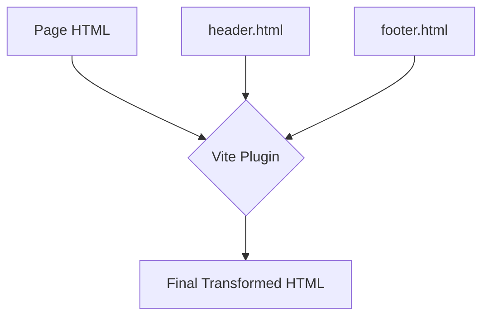

# Project Architecture

This document explains the technical architecture of the Personal Profile Website, including the custom web component system and the build-time HTML partial injection.

## Technical Stack

- **Build Tool:** [Vite](https://vitejs.dev/)
- **Logic:** Vanilla JavaScript (ES6+)
- **Styling:** Vanilla CSS
- **Icons:** [Bootstrap Icons](https://icons.getbootstrap.com/)

---

## 1. Custom Web Components

We use vanilla **Web Components** for reusable UI elements. Each component is self-contained in its own directory under `src/assets/js/components/`.

### Component Structure

A typical component (e.g., `audio-player`) consists of:

- `audio-player.js`: The class extending `HTMLElement`.
- `audio-player-template.js`: A function returning the HTML string for the component.
- `style.css`: Scoped styles for the component.

### Component Workflow

1.  **Definition:** The component class reads attributes (like `track-id`, `track-src`) via getters.
2.  **Rendering:** In `connectedCallback()`, the component uses its template function to set `this.innerHTML`.
3.  **Registration:** Components are registered using `customElements.define()` in the entry JS files (e.g., `src/main.js`).

> [!TIP]
> This approach provides reusable UI blocks without the overhead of a heavy framework, making the site fast and easy to maintain.

---

## 2. HTML Partials System

To share common elements like the header and footer across multiple pages, we use a custom Vite plugin (`site-partials`) defined in `vite.config.js`.

### How it Works

The plugin scans HTML files for specific markers and replaces them with the content of partial files during the build or development process.



### Usage

Add these markers to any page under `src/`:

```html
<!-- @site-header -->
<main> <!-- Page Content --> </main>
<!-- @site-footer -->
```

### Partial Dependencies

- **Header Logic:** Managed by `src/assets/js/header.js` (mobile menu, theme toggling).
- **Styles:** Located in `src/assets/styles/header.css` and `src/assets/styles/footer.css`.

---

## 3. Theme Management

The site supports Light and Dark modes.

- **Storage:** The user's preference is saved in `localStorage` under the key `theme`.
- **Logic:** `header.js` handles the toggle and applies the `data-theme` attribute to `document.documentElement`.
- **CSS:** Global variables in `src/assets/styles/global.css` adapt based on the `[data-theme]` attribute.

> [!NOTE]
> If no preference is saved, the site defaults to the user's system preference via `prefers-color-scheme`.
